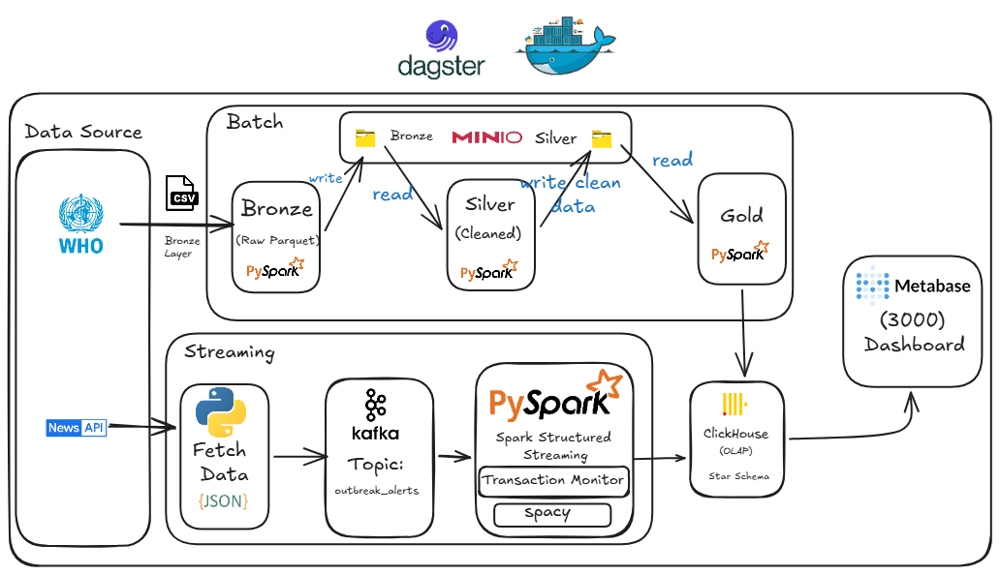

# Health Outbreak Monitoring System


## Project Description

A comprehensive end-to-end data engineering platform designed to ingest, process, and analyze infectious disease outbreak data. The system combines historical batch data processing with real-time news streaming to provide a unified data warehouse.

* **What the project does:**
  Aggregates raw disease outbreak records and correlates them with live NLP-analyzed global news alerts.

* **The business problem:**
  Tracking global disease outbreaks manually is slow; public health organizations need automated correlations between historical epidemiological data and real-time news anomalies.

* **Why the project exists:**
  To provide early warnings, actionable insights, and comprehensive analytics for monitoring public health crises.

* **Expected users:**
  Data Analysts, Epidemiologists, Public Health Officials, and Policy Makers.

* **Expected outputs:**
  Cleaned dimensional datasets stored efficiently in ClickHouse and interactive dashboards visualized through Metabase.

---

# Project Objectives

* Ingest historical outbreak data from CSV files hosted in MinIO (S3-compatible Data Lake).
* Stream real-time global health news utilizing NewsAPI and Apache Kafka.
* Perform robust ETL operations including data cleansing, NLP entity extraction, and schema mapping using PySpark.
* Automate and orchestrate batch and streaming workflows using Dagster.
* Construct a dimensional Data Warehouse (Star Schema) using ClickHouse.
* Visualize epidemiological trends and streaming alerts using Metabase.

---

# Technologies Used

| Technology              | Purpose                                     |
| ----------------------- | ------------------------------------------- |
| Dagster                 | Pipeline orchestration and scheduling       |
| Apache Spark (PySpark)  | Distributed batch and stream processing     |
| Apache Kafka            | Real-time event streaming                   |
| ClickHouse              | Columnar Data Warehouse and analytics       |
| PostgreSQL              | Metadata storage for Dagster and Metabase   |
| MinIO                   | S3-compatible Object Storage Data Lake      |
| Docker & Docker Compose | Containerization and Infrastructure as Code |
| Metabase                | BI Dashboarding and visualization           |
| Python                  | ETL development and scripting               |
| spaCy                   | NLP entity extraction                       |
| NewsAPI                 | Real-time health news ingestion             |

---

# Project Architecture

The architecture follows the **Medallion Architecture Pattern (Bronze, Silver, Gold)** while supporting both batch and streaming processing.

## Architecture Flow

* **Data Sources**

  * Historical CSV outbreak datasets
  * Real-time health news from NewsAPI

* **Data Lake**

  * MinIO provides S3-compatible object storage.

* **Bronze Layer**

  * Raw ingestion layer.
  * Converts source data into structured Parquet files.

* **Silver Layer**

  * Data cleansing.
  * NULL handling.
  * Data normalization.

* **Gold Layer**

  * Dimensional modeling.
  * SCD Type 2 implementation.
  * Fact table generation.

* **Data Warehouse**

  * ClickHouse stores analytical tables using MergeTree engines.

* **Visualization**

  * Metabase connects to ClickHouse for dashboards.

---

# Architecture Diagram

The following diagram illustrates the complete end-to-end architecture of the Health Outbreak Monitoring System.


# Project Structure

```text
dagster_space/

├── checkpoints/                 
│   └── Spark Streaming checkpoint metadata

├── dagster_code/

│   ├── assets/
│   │
│   │   ├── batch/
│   │   │   └── Bronze, Silver, Gold Dagster ETL assets
│   │   │
│   │   └── streaming/
│   │       └── Kafka producer and Spark streaming consumer scripts
│   │
│   ├── data/
│   │   └── Raw datasets (example: disease_outbreaks_HDX.csv)
│   │
│   ├── infrastructure/
│   │   └── ClickHouse warehouse SQL schemas
│   │
│   ├── definitions.py
│   │   └── Dagster jobs, assets, and schedules
│   │
│   └── workspace.yaml
│       └── Dagster workspace configuration
│
├── plugins/
│   └── Metabase ClickHouse JDBC drivers
│
├── shared_jars/
│   └── Spark connectors for Kafka, ClickHouse, and AWS S3
│
├── .env
│   └── Environment variables and secrets
│
├── .gitignore
│
├── docker-compose.yml
│   └── Multi-container infrastructure definition
│
├── Dockerfile
│   └── Custom Python/Spark environment
│
├── requirements.txt
│   └── Python dependencies
│
└── setup_minio.py
    └── Creates MinIO buckets and uploads initial datasets
```

---

# Data Pipeline

The system implements a complete end-to-end data pipeline combining batch processing and real-time streaming.

## 1. Data Ingestion

### Historical Batch Data

Historical outbreak records are uploaded from CSV files into MinIO using:

```
setup_minio.py
```

MinIO acts as the Data Lake landing zone where raw datasets are stored.

### Real-Time News Streaming

Health-related news is collected using:

```
news_producer.py
```

The producer:

* Connects to NewsAPI.
* Retrieves global health-related articles.
* Filters relevant content.
* Converts articles into JSON events.
* Publishes messages into Apache Kafka topics.

---

# 2. Bronze Layer

**Component:**

```
bronze.py
```

Responsibilities:

* Reads raw CSV files from MinIO using S3 protocol.
* Applies schema enforcement.
* Converts raw files into optimized Parquet format.
* Maintains the original source structure.
* Creates the first reliable data layer.

Output:

```
Bronze Parquet Files
```

---

# 3. Silver Layer

**Component:**

```
silver.py
```

Responsibilities:

* Data quality validation.
* Removing incomplete records.
* Handling NULL values.
* Removing duplicates.
* Standardizing text fields.
* Cleaning geographical attributes.

Output:

```
Clean Silver Dataset
```

---

# 4. Gold Layer

**Component:**

```
gold_assets.py
```

Responsibilities:

* Builds dimensional models.
* Creates fact and dimension tables.
* Implements Slowly Changing Dimension Type 2 (SCD2).
* Performs Spark Broadcast Joins.
* Loads analytical data into ClickHouse.

Output:

```
ClickHouse Data Warehouse
```

---

# 5. Streaming Processing Pipeline

## News Producer

**File:**

```
news_producer.py
```

Workflow:

```
NewsAPI
   |
   ↓
Python Producer
   |
   ↓
Kafka Topic
```

The producer runs periodically and sends structured health news events.

---

## Spark Streaming Consumer

**File:**

```
news_consumer.py
```

Workflow:

```
Kafka Topic
      |
      ↓
Spark Structured Streaming
      |
      ↓
spaCy NLP Processing
      |
      ↓
Entity Extraction
      |
      ↓
ClickHouse fact_outbreak_alerts
```

The consumer:

* Reads streaming events from Kafka.
* Applies NLP processing.
* Extracts diseases and locations.
* Maps entities into warehouse dimensions.
* Stores outbreak alerts in ClickHouse.

---

# ETL Workflow

## Batch Processing Flow

```text
CSV Files
    |
    ↓
MinIO Data Lake
    |
    ↓
Bronze Layer
    |
    ↓
Silver Layer
    |
    ↓
Gold Layer
    |
    ↓
ClickHouse Warehouse
    |
    ↓
Metabase Dashboard
```

---

## Streaming Processing Flow

```text
NewsAPI
    |
    ↓
news_producer.py
    |
    ↓
Apache Kafka
    |
    ↓
Spark Structured Streaming
    |
    ↓
spaCy NLP Extraction
    |
    ↓
fact_outbreak_alerts
    |
    ↓
Metabase Dashboard
```

---

# Pipeline Orchestration

Dagster manages the complete workflow:

Responsibilities:

* Scheduling batch jobs.
* Triggering streaming components.
* Monitoring execution status.
* Tracking pipeline failures.
* Providing execution logs.
* Managing dependencies between assets.

The main workflows are:

```
monthly_outbreak_batch_job
```

for historical processing.

and:

```
streaming_news_producer_job
```

for real-time news ingestion.

```
```
# How to Run the Project

## Prerequisites

Before running the project, make sure the following requirements are installed:

* Docker
* Docker Compose
* Java JRE
* Python 3.10+
* Git

Required configurations:

* Environment variables configured inside `.env`
* Dataset files available inside:

```text
dagster_code/data/
```

---

# Installation

## 1. Clone Repository

```bash
git clone <repository_url>

cd dagster_space
```

---

## 2. Configure Environment Variables

Create and configure the `.env` file:

```env
NEWS_API_KEY=your_api_key

POSTGRES_USER=your_user
POSTGRES_PASSWORD=your_password

CLICKHOUSE_USER=your_user
CLICKHOUSE_PASSWORD=your_password
```

The environment file stores:

* API keys
* Database credentials
* Service configurations

---

## 3. Start Infrastructure

Build and start all services using Docker Compose:

```bash
docker-compose up -d --build
```

This starts:

* Dagster
* Spark
* Kafka
* ClickHouse
* PostgreSQL
* MinIO
* Metabase

---

## 4. Install Python Dependencies

If running components locally:

```bash
pip install -r requirements.txt
```

---

## 5. Initialize Data Lake

Upload initial datasets into MinIO:

```bash
python setup_minio.py
```

This script:

* Creates required buckets.
* Uploads source CSV files.
* Prepares the Data Lake environment.

---

# Running Dagster

Dagster is responsible for workflow orchestration.

The Dagster Webserver and Daemon run automatically inside Docker.

Access the Dagster UI:

```text
http://localhost:3001
```

From the interface you can:

* Monitor assets.
* Execute pipelines manually.
* Review logs.
* Track failures.

Main pipelines:

```text
monthly_outbreak_batch_job
```

Responsible for:

* Bronze processing.
* Silver cleaning.
* Gold warehouse loading.

```text
streaming_news_producer_job
```

Responsible for:

* Scheduling news ingestion.
* Publishing events into Kafka.

---

# Running Apache Spark

Spark executes all distributed processing tasks.

Components:

## Spark Batch Processing

Responsible for:

* Historical outbreak processing.
* Data cleaning.
* Dimensional modeling.
* Warehouse loading.

## Spark Streaming

Responsible for:

* Consuming Kafka events.
* NLP processing.
* Real-time alert generation.

Spark Master UI:

```text
http://localhost:8090
```

The interface provides:

* Running applications.
* Worker status.
* Execution monitoring.
* Resource utilization.

---

# Running Apache Kafka

Kafka works as the real-time messaging layer.

Architecture:

```text
NewsAPI
   |
   ↓
Python Producer
   |
   ↓
Kafka Topic
   |
   ↓
Spark Streaming Consumer
```

Kafka responsibilities:

* Buffer incoming news events.
* Provide fault-tolerant messaging.
* Enable real-time processing.

Kafka UI:

```text
http://localhost:8085
```

Used for:

* Monitoring topics.
* Viewing messages.
* Tracking offsets.

---

# Running PostgreSQL

PostgreSQL is used as metadata storage.

Responsibilities:

* Dagster metadata database.
* Metabase application database.
* Pipeline execution states.

PostgreSQL starts automatically through Docker Compose.

---

# Running MinIO

MinIO provides the S3-compatible Data Lake storage.

Interfaces:

## Console

```text
http://localhost:19001
```

## API Endpoint

```text
http://localhost:19000
```

Default credentials:

```text
Username:
admin

Password:
minioadmin
```

MinIO stores:

* Raw CSV files.
* Bronze Parquet files.
* Silver Parquet files.

---

# Running Metabase

Metabase provides Business Intelligence dashboards.

Access:

```text
http://localhost:3000
```

Metabase connects directly to ClickHouse.

Features:

* Disease outbreak analytics.
* Geographic visualization.
* Historical trends.
* Real-time alerts.

The ClickHouse driver is provided through:

```text
plugins/clickhouse.metabase-driver.jar
```
# Data Warehouse Design

The Data Warehouse follows a dimensional **Star Schema** architecture optimized for analytical workloads.

The warehouse is implemented using ClickHouse with MergeTree-family engines.

---

# Dimension Tables

## dim_location

Purpose:

Stores geographical information related to outbreak events.

Features:

* Country information.
* ISO codes.
* WHO regions.
* Geographic hierarchy.

Storage engine:

```sql
ReplacingMergeTree
```

Used for:

* Deduplication.
* Latest record selection.

---

## dim_disease

Purpose:

Stores disease-related attributes.

Features:

* Disease names.
* Disease classifications.
* Historical changes.

Implementation:

```text
Slowly Changing Dimension Type 2 (SCD Type 2)
```

Tracks changes using:

* is_current
* start_date
* end_date

---

# Fact Tables

## fact_outbreaks

Purpose:

Stores historical outbreak measurements.

Contains:

* Disease keys.
* Location keys.
* Report year.
* Outbreak counts.

Optimization:

* Partitioning by year.
* MergeTree storage engine.

---

## fact_outbreak_alerts

Purpose:

Stores real-time outbreak alerts extracted from news streams.

Source:

```text
NewsAPI → Kafka → Spark Streaming → ClickHouse
```

Features:

* Real-time ingestion.
* NLP extracted entities.
* Deduplication using ingestion timestamp.

---

# Main Project Components

## bronze.py

Purpose:

Raw data ingestion layer.

Responsibilities:

* Reading source CSV files.
* Schema enforcement.
* Converting data into Parquet format.
* Creating Bronze layer.

---

## silver.py

Purpose:

Data quality processing.

Responsibilities:

* Removing invalid records.
* Handling missing values.
* Removing duplicates.
* Standardizing text fields.
* Cleaning geographical data.

---

## gold_assets.py

Purpose:

Data warehouse modeling.

Responsibilities:

* Creating dimensions and facts.
* Implementing SCD Type 2.
* Performing Spark Broadcast Joins.
* Loading analytical tables into ClickHouse.

---

## news_producer.py

Purpose:

Real-time event generator.

Responsibilities:

* Connecting to NewsAPI.
* Collecting health news.
* Filtering relevant articles.
* Publishing JSON messages to Kafka.

---

## news_consumer.py

Purpose:

Real-time streaming engine.

Responsibilities:

* Reading Kafka messages.
* Running Spark Structured Streaming.
* Applying spaCy NLP models.
* Extracting diseases and locations.
* Writing alerts into ClickHouse.

---

## warehouse_gold_schema.sql

Purpose:

Data warehouse schema definition.

Responsibilities:

* Creating ClickHouse tables.
* Defining MergeTree engines.
* Creating analytical structures.

---

## setup_minio.py

Purpose:

Data Lake initialization.

Responsibilities:

* Creating MinIO buckets.
* Uploading initial datasets.
* Preparing storage environment.

---

# Project Features

The platform provides:

* Batch Processing
* Real-Time Streaming
* ETL Pipelines
* Data Lake Architecture
* Data Warehouse
* Dashboard Analytics
* Docker Containerization
* Dagster Orchestration
* Apache Spark Processing
* Apache Kafka Streaming
* ClickHouse Analytics
* Slowly Changing Dimensions Type 2
* NLP-Based Entity Extraction

---

# Performance Optimizations

## Spark Broadcast Joins

Small dimension tables are broadcast to Spark workers:

```python
broadcast(dim_location)
broadcast(dim_disease)
```

Benefits:

* Reduces shuffle operations.
* Improves join performance.
* Optimizes distributed processing.

---

## Columnar Storage

Parquet format is used for intermediate datasets.

Benefits:

* High compression.
* Faster analytical queries.
* Reduced storage requirements.

---

## ClickHouse Optimization

Uses:

* MergeTree engine.
* ReplacingMergeTree engine.
* Partitioning by year.
* Optimized sorting keys.

Benefits:

* Fast aggregation queries.
* Efficient analytical workloads.

---

# Error Handling

## ETL Reliability

All PySpark jobs include:

* Exception handling.
* Execution logging.
* Dagster failure reporting.

---

## API Recovery

News ingestion implements:

* Retry mechanisms.
* Timeout handling.
* API failure recovery.

---

## Streaming Recovery

Spark Structured Streaming uses checkpoints:

```text
/opt/spark/checkpoints/
```

Benefits:

* Prevents data loss.
* Allows automatic recovery after failures.

---

# Future Improvements

Possible future enhancements:

* Add WHO direct data feeds.
* Integrate additional health APIs.
* Add Kafka Schema Registry.
* Implement Great Expectations for automated data quality testing.
* Add Infrastructure as Code for dashboards.
* Expand NLP models for better outbreak detection.

---

# License

This project is licensed under the MIT License.

See the [LICENSE](LICENSE) file for more details.

---

# Authors

**Abdullah Shamsan**

Data Engineering Project

- GitHub: https://github.com/Abdullah773903529
- LinkedIn: https://linkedin.com/in/abdullahshamsan
